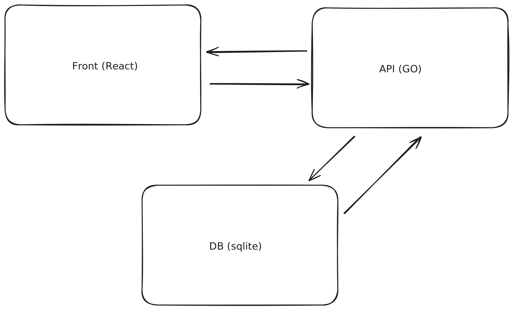

# atw (Around the world)

Ce projet a pour but de retracer les différents lieux que j'ai pu visiter. 

## Raison

Avant de commencer la réalisation de ce projet me suis dits pourquoi faire cet outil alors que google maps permet de se créer des cartes personnalisées.
Mais je me suis dit que : 
 - Ce serait quand même top de pouvoir auto-héberger la base de données que j'ai pu visiter (pas une confiance absolue en google en matière de privacy)
 - Ça s'inscrit dans ma démarche de me créer une plateforme globale qui va me permettre de gérer ses différentes petites choses qui nous facilitent la vie

## Usage

Le but de cet outil est d'être utilisé pour choisir une destination de vacances, 
ça permet de connaître en un coup d'oeil les villes ou les pays que l'on n'a pas encore eu l'occasion de visiter.

## Architecture 



## Setup frontend
To run this project, install it locally using yarn:

```
$ yarn install
$ yarn dev
```

## Setup backend
```
$ TODO
```
